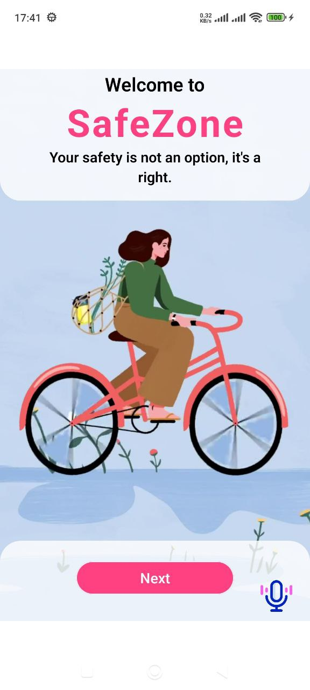
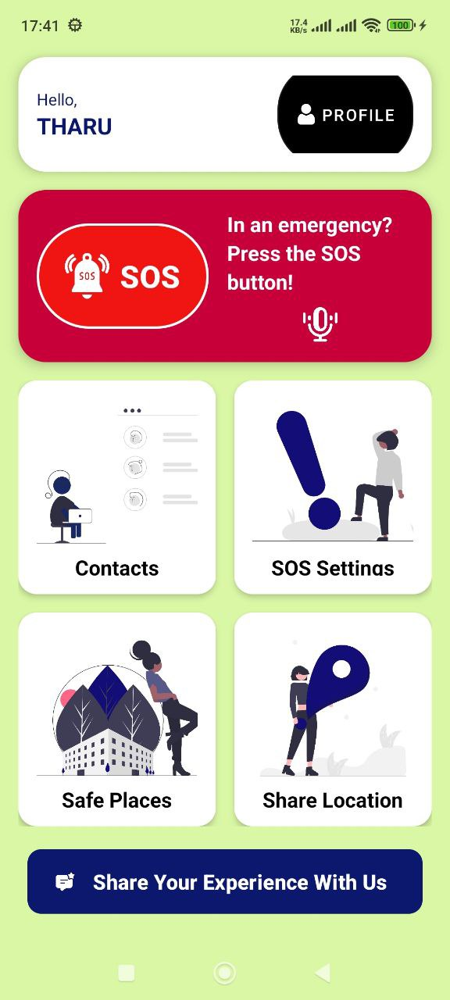

# SafeZone Android App 🚨

**SafeZone** is a personal safety and emergency response Android application developed using **Java** and **Android Studio**. It empowers users to send SOS alerts to trusted contacts during emergencies via **SMS and phone calls**, based on **contact priority levels**. It also provides quick access to nearby emergency services using **Google Maps**.

---

## 🔑 Features

- 🕒 **SOS Activation Timer** — Tracks how long the SOS mode has been active.
- 📡 **Priority-Based Alert Sharing** — Sends alerts to top-priority contacts first.
- 📲 **Automated SMS & Call Alerts** — Notifies contacts with prewritten emergency messages.
- 🔁 **Repeat Alerts** — Configurable repeat count and alert intervals.
- 🗺️ **Google Maps Integration** — One-tap access to nearby hospitals, police stations, and other safe places.
- 🔔 **Shake or Voice Trigger (Optional)** — Allows hands-free SOS activation.
- 🛑 **Deactivation Mode** — Stops alert cycles and updates UI to indicate SOS has ended.
- 🏠 **Quick Navigation** — Built-in shortcuts to view contacts, safe places, or go back home.

---

### 🔐 SOS Login Screen

### 📊 SOS Dashboard

---

## ⚙️ Tech Stack

- 💻 Java
- 📱 Android SDK
- 📍 Google Maps API
- 📤 SMSManager & CALL Intent
- 🧠 SQLite for contact storage

---
## 📬 License
This project is for educational and personal use only
All emergency features are simulated for academic demonstration purposes.
---

## 🙋‍♀️ Developed By

> **Tharushi Nikethana**  
> Open University Sri Lanka(Bachelor Of Software Engineering) 
> Mobile App Modelu Final Project – Mobile App Development & Safety Systems
